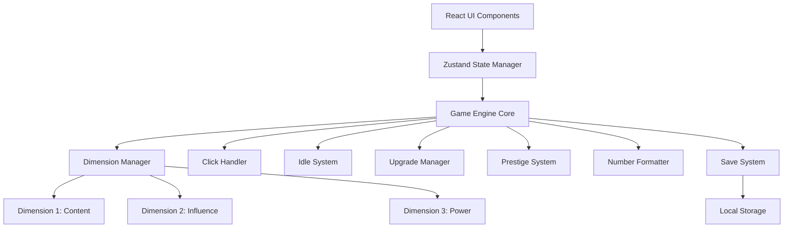

# Design Document: Asymptote - An Idle System

## Game Title & Theme

**Asymptote: An Idle System** - A multi-dimensional idle game about approaching limits, diminishing returns, and the progression from authentic content creation through corporate optimization to tech oligarchy.

## Overview

Asymptote is a single-page web application featuring a three-dimension progression system. Each dimension represents a different stage of digital content evolution, with distinct aesthetics and mechanics. The core mechanic is the asymptote: players approach theoretical maximums in each dimension, experiencing diminishing returns that drive them to shift between dimensions to break through limits.

## Three-Dimension Structure

### Dimension 1: Content (YouTube Creator)
**Theme**: Organic growth, authenticity, passion projects  
**Aesthetic**: YouTube Studio analytics dashboard  
**Visual Style**: 
- Card-based layout with metrics
- Line graphs showing growth
- Clean, modern, creator-friendly
- YouTube-inspired color palette

**Currencies**:
- **Clicks** (Tier 1): Base currency from manual clicking
- **Views** (Tier 2): Passive resource from generators
- **Strategy Points (SP)** (Prestige): Earned through prestige resets

**Meta-Progression**:
- **Engagement**: Permanent multiplier that grows from SP
- Growth rate: `0.1 × SP per hour`
- Applies only to Dimension 1
- Never resets, even through meta-prestige

**Generators** (Traffic Sources):
- Click Bot
- Script Farm
- Recommendation Engine

**Upgrades**:
- Better Content (base value)
- Double Tap (click multiplier)
- Viral Moment (temporary boost)

**Asymptote**: ~1000 SP  
**Formula**: `(totalEarned / 50000)^0.6`  
**Unlock Dimension 2**: Reach 100 SP

---

### Dimension 2: Influence (Corporate Machine)
**Theme**: Monetization, optimization, growth hacking, algorithms  
**Aesthetic**: Microsoft/LinkedIn corporate sterile  
**Visual Style**:
- Sharp edges, grid-based layouts
- Flat design, no personality
- Corporate sans-serif fonts
- Lots of whitespace
- "Professional" stock photo energy

**Color Palette**:
- Primary: `#0078d4` (Microsoft blue)
- Secondary: `#106ebe` (darker blue)
- Accent: `#00b294` (teal/success green)
- Background: `#f3f2f1` (corporate gray)

**Currencies**:
- **Impressions** (Tier 1): Manual actions ("buying ads")
- **Reach** (Tier 2): Passive from generators
- **Influence Points (IP)** (Prestige): Earned through prestige

**Meta-Progression**:
- **Authority**: Permanent multiplier that grows from IP
- Growth rate: `0.1 × IP per hour`
- Applies only to Dimension 2
- Never resets

**Cross-Dimension Effect**:
- **Influence → Dimension 1**: Boosts SP generation
- Formula: `SP = (totalEarned / 50000)^0.6 × (1 + Influence × 0.1)`
- This breaks Dimension 1's asymptote

**Generators** (Growth Mechanisms):
- Ad Network
- SEO Bot
- Viral Algorithm
- Influencer Partnership

**Upgrades**:
- Targeted Ads (base value)
- A/B Testing (click multiplier)
- Trending Boost (temporary boost)

**UI Elements**:
- Everything is a "card" with drop shadows
- Buttons say "Optimize" and "Scale"
- Metrics everywhere, dashboards, KPIs
- Progress bars called "Performance Indicators"

**Asymptote**: ~100 IP  
**Formula**: `(totalEarned / threshold)^0.5`  
**Unlock Dimension 3**: Reach 50 IP

---

### Dimension 3: Power (Tech Oligarchy)
**Theme**: Monopoly, control, surveillance capitalism  
**Aesthetic**: Faux-Friendly Evil (TBD - final aesthetic to be determined)  
**Concept**: Looks like Google/Apple design but something feels *wrong*

**Potential Aesthetic Direction**:
- Pastel colors, rounded corners
- Uncanny valley of UI design
- "We're here to help" while clearly exploiting
- Everything has friendly names masking evil intent

**Currencies**:
- **Control** (Tier 1): Manual actions ("acquisitions")
- **Dominance** (Tier 2): Passive from generators
- **Power Points (PP)** (Prestige): Earned through prestige

**Meta-Progression**:
- **Hegemony**: Permanent multiplier that grows from PP
- Growth rate: `0.1 × PP per hour`
- Applies only to Dimension 3
- Never resets

**Cross-Dimension Effect**:
- **Power → Dimension 2**: Boosts IP generation
- Formula: `IP = (totalEarned / threshold)^0.5 × (1 + Power × 0.1)`
- **NO REVERSE EFFECT**: Nothing from Dim 3 helps Dim 1 or 2 directly

**Generators** (Consolidation Mechanisms):
- Market Manipulation
- Regulatory Capture
- Platform Monopoly
- Data Harvesting

**Upgrades**:
- Hostile Takeover (base value)
- Lobbying (click multiplier)
- Crisis Exploitation (temporary boost)

**UI Elements** (Conceptual):
- "Personalized Experience" (surveillance)
- "Community Guidelines" (censorship)
- "Trusted Partners" (data brokers)
- Everything looks helpful but isn't

**Asymptote**: ~10 PP  
**Formula**: `(totalEarned / threshold)^0.4` (harshest diminishing returns)  
**Victory**: Reach 10 PP or narrative milestone

---

## The Asymptote Loop

### Core Mechanic: Diminishing Returns
Each dimension has an asymptotic curve. Progress becomes exponentially slower as you approach the theoretical maximum. Players must shift dimensions to break through these limits.

### Optimal Strategy Loop
```
1. Farm Dimension 1 → Hit SP asymptote (~100 SP)
2. Shift to Dimension 2 → Farm Influence
3. Return to Dimension 1 → Blow past old SP limit (Influence breaks asymptote)
4. Farm more SP → Grow Engagement faster
5. Return to Dimension 2 → Farm more Influence (faster with Engagement)
6. Unlock Dimension 3
7. Enter Dimension 3 → Realize you're underpowered
8. Cycle Dim 1 ⇄ Dim 2 to build up
9. Return to Dimension 3 → Make progress
10. Repeat until victory
```

### Player Journey Arc
**Act 1: Discovery (Dimension 1)**
- Learn basic mechanics
- Hit SP asymptote
- Unlock Dimension 2

**Act 2: The Loop (Dim 1 ⇄ Dim 2)**
- Cycle between dimensions
- Optimize the loop
- Build permanent power (Engagement)
- Prepare for Dimension 3

**Act 3: The Challenge (Dimension 3)**
- Face the final dimension
- Realize you need more power
- Grind Dim 1 ⇄ Dim 2 to prepare
- Return to Dim 3 and progress
- Victory / Social commentary reveal

---

## Architecture

### Technology Stack

**Frontend Framework**: React with TypeScript
- Excellent performance for frequent UI updates
- Strong typing prevents calculation errors
- Large ecosystem and community support

**State Management**: Zustand
- Lightweight and performant
- Simple API with TypeScript support
- Built-in persistence capabilities

**Large Number Library**: decimal.js
- Handles arbitrary precision arithmetic
- Supports numbers beyond JavaScript's limits
- Maintains precision for complex calculations

**Build Tool**: Vite
- Fast development server
- Optimized production builds
- Excellent TypeScript support

**Deployment**: Static hosting (Netlify/Vercel)

### System Architecture



## Core Interfaces

### Game State

```typescript
interface GameState {
  // Current dimension
  currentDimension: 1 | 2 | 3;
  
  // Dimension 1: Content
  currency: Decimal; // Clicks
  views: Decimal;
  engagement: Decimal; // Permanent, Dim 1 only
  
  // Dimension 2: Influence (placeholder)
  influence: Decimal; // Not yet implemented
  
  // Dimension 3: Power (placeholder)
  // To be implemented
  
  // Prestige
  prestigePoints: Decimal; // SP for current dimension
  totalPrestiges: number;
  
  // Core systems
  idleGenerators: IdleGenerator[];
  upgrades: Upgrade[];
  temporaryEffects: TemporaryEffect[];
  
  // Persistence
  lastSaveTime: number;
  lastActiveTime: number;
  simulationSpeed: number; // For bot simulation
  
  settings: GameSettings;
}
```

### Dimension Manager (Future)

```typescript
interface DimensionManager {
  currentDimension: 1 | 2 | 3;
  
  shiftDimension(target: 1 | 2 | 3): boolean;
  canShiftTo(target: 1 | 2 | 3): boolean;
  
  // Each dimension has its own state
  getDimensionState(dim: 1 | 2 | 3): DimensionState;
}
```

## Engagement System (Dimension 1)

### Growth Mechanics
- **Source**: Strategy Points (SP)
- **Rate**: `0.1 × SP per hour`
- **Effect**: Multiplies all production in Dimension 1
- **Persistence**: Never resets, even through meta-prestige

### Examples
- 10 SP: +1 engagement/hour
- 100 SP: +10 engagement/hour
- 1000 SP: +100 engagement/hour

### Application
```typescript
// All Dimension 1 calculations
finalValue = baseValue × (1 + 0.1 × SP) × Engagement
```

Engagement amplifies the SP multiplier, creating compound growth over time.

## Implementation Status

### Phase 1: Complete ✓
- Dimension 1 fully functional
- SP → Engagement growth implemented
- Engagement applies only to Dimension 1
- Infrastructure for multi-dimension system in place
- Bot strategy updated for Dimension 1

### Phase 2: Planned
- Implement Dimension 2 (Influence)
- Create dimension switching UI
- Add Influence → SP boost mechanic
- Apply corporate aesthetic

### Phase 3: Planned
- Implement Dimension 3 (Power)
- Finalize aesthetic direction
- Add social commentary elements
- Victory conditions

---

## Correctness Properties

*A property is a characteristic or behavior that should hold true across all valid executions of a system-essentially, a formal statement about what the system should do. Properties serve as the bridge between human-readable specifications and machine-verifiable correctness guarantees.*

Now I need to analyze the acceptance criteria to determine which ones can be tested as properties. Let me use the prework tool:

### Property 1: Click Processing Correctness
*For any* game state and sequence of clicks, the total currency gained should equal the base click value multiplied by all active multipliers, multiplied by the number of clicks processed.
**Validates: Requirements 1.1, 1.2, 1.3**

### Property 2: Offline Progress Calculation
*For any* idle system configuration and offline duration, the calculated offline progress should equal the mathematical expectation based on generation rates, efficiency multipliers, and time caps.
**Validates: Requirements 2.1, 2.3, 2.4, 2.5**

### Property 3: Upgrade Purchase Transaction
*For any* valid upgrade purchase, the transaction should atomically deduct the cost, apply the benefit, and update the upgrade state.
**Validates: Requirements 3.1, 3.2**

### Property 4: Exponential Cost Scaling
*For any* upgrade with exponential scaling, the cost at level N should equal the base cost multiplied by the cost multiplier raised to the power of N.
**Validates: Requirements 3.3**

### Property 5: Large Number Arithmetic Precision
*For any* arithmetic operations on large numbers (beyond JavaScript's safe integer range), the results should maintain mathematical precision without overflow or rounding errors.
**Validates: Requirements 4.2, 4.4**

### Property 6: Number Formatting Consistency
*For any* number above 1,000, the formatted output should use consistent notation rules (suffix or scientific) and appropriate decimal places for readability.
**Validates: Requirements 4.1, 4.3, 4.5**

### Property 7: Save System Round-Trip
*For any* valid game state, saving then loading should produce an equivalent game state with all data preserved.
**Validates: Requirements 5.2, 6.4**

### Property 8: Save Export Format Validation
*For any* game state, development mode exports should produce valid JSON, and production mode exports should produce decodable hash strings that round-trip correctly.
**Validates: Requirements 6.2, 6.3**

### Property 9: Automation Effect Stacking
*For any* combination of active automation systems, the total automated generation should equal the sum of individual system contributions with all multipliers applied.
**Validates: Requirements 7.2, 7.3**

### Property 10: Prestige Reset Selectivity
*For any* prestige reset operation, only base progress should be reset while prestige bonuses, meta prestige bonuses, and achievements remain preserved.
**Validates: Requirements 8.2**

### Property 11: Meta Prestige Complete Reset
*For any* meta prestige reset operation, all progress including prestige should be reset while only meta prestige bonuses remain preserved.
**Validates: Requirements 9.2**

### Property 12: Bonus Application Consistency
*For any* game calculation, all applicable bonuses (click multipliers, prestige bonuses, meta prestige bonuses) should be applied in the correct order and magnitude.
**Validates: Requirements 8.5, 9.5**

### Property 13: Achievement Unlock Conditions
*For any* achievement with defined conditions, the achievement should unlock immediately when all conditions are met and remain permanently unlocked.
**Validates: Requirements 12.1, 12.2**

### Property 14: UI State Synchronization
*For any* game state change, all relevant UI elements should update to reflect the new state immediately and consistently.
**Validates: Requirements 11.5**

### Property 15: Error Handling Preservation
*For any* invalid input or corrupted data, the system should handle the error gracefully while preserving the current valid game state.
**Validates: Requirements 5.3, 6.5**

## Error Handling

### Input Validation
- All user inputs (clicks, purchases, imports) are validated before processing
- Invalid inputs are rejected with appropriate error messages
- Game state remains unchanged when invalid operations are attempted

### Save Data Corruption
- Corrupted save data triggers initialization of a new game state
- Backup saves are maintained to prevent total progress loss
- Import validation prevents malformed data from corrupting the game

### Large Number Overflow
- decimal.js library prevents JavaScript number overflow issues
- All calculations maintain precision for numbers up to 10^308
- Graceful degradation for extremely large numbers using exponential notation

### Browser Compatibility
- Feature detection for required browser APIs
- Graceful fallbacks for unsupported features
- Clear error messages for incompatible browsers

## Testing Strategy

### Dual Testing Approach
The testing strategy combines unit tests for specific examples and edge cases with property-based tests for comprehensive input coverage.

**Unit Tests Focus:**
- Specific examples that demonstrate correct behavior
- Edge cases and boundary conditions
- Integration points between components
- Error conditions and recovery

**Property Tests Focus:**
- Universal properties that hold for all inputs
- Comprehensive input coverage through randomization
- Mathematical correctness across large input spaces
- System invariants and consistency

### Property-Based Testing Configuration
- **Library**: fast-check for TypeScript/JavaScript property-based testing
- **Minimum iterations**: 100 per property test for statistical confidence
- **Test tagging**: Each property test references its design document property
- **Tag format**: **Feature: idle-clicker-game, Property {number}: {property_text}**

### Test Categories

**Core Mechanics Testing:**
- Click processing with various multiplier combinations
- Idle generation calculations across different time periods
- Upgrade cost scaling and effect application
- Large number arithmetic operations

**Persistence Testing:**
- Save/load round-trip testing with various game states
- Export/import functionality in both development and production modes
- Corruption handling and recovery scenarios

**Progression System Testing:**
- Prestige and meta prestige reset operations
- Bonus calculation and application
- Achievement unlock conditions and persistence

**UI Integration Testing:**
- State synchronization between game engine and UI
- User interaction handling and feedback
- Error message display and user guidance

### Performance Testing
While property-based tests focus on correctness, performance characteristics are validated through:
- Load time measurements for game initialization
- Frame rate monitoring during intensive operations
- Memory usage tracking for long-running sessions
- Offline calculation performance for extended periods

The combination of unit tests and property-based tests ensures both specific functionality works correctly and that the system maintains mathematical and logical consistency across all possible inputs and states.