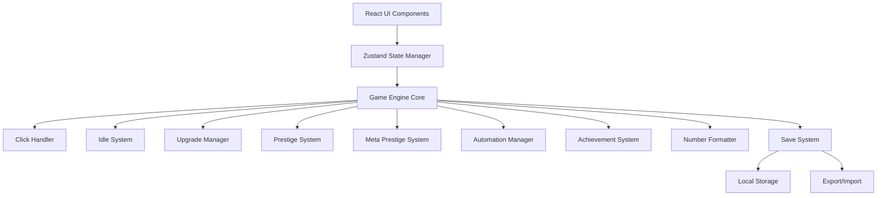

# Design Document: Idle Clicker Game

## Overview

The idle clicker game will be built as a single-page web application using modern web technologies. The architecture prioritizes performance for large number calculations, smooth UI updates, and reliable state persistence. The game features a progression system that starts with pure clicking mechanics and gradually unlocks idle capabilities through prestige upgrades.

## Architecture

### Technology Stack

**Frontend Framework**: React with TypeScript
- Provides excellent performance for frequent UI updates
- Strong typing helps prevent calculation errors with large numbers
- Large ecosystem and community support
- Excellent development tools and debugging capabilities

**State Management**: Zustand
- Lightweight and performant for frequent state updates
- Simple API that works well with TypeScript
- Built-in persistence capabilities for save/load functionality
- No boilerplate compared to Redux

**Large Number Library**: decimal.js
- Handles arbitrary precision arithmetic without overflow
- Supports numbers far beyond JavaScript's Number.MAX_VALUE
- Maintains precision for complex calculations
- Well-tested and widely used in financial applications

**Build Tool**: Vite
- Fast development server with hot module replacement
- Optimized production builds
- Excellent TypeScript support
- Modern ES modules support

**Deployment**: Static hosting (Netlify/Vercel)
- Simple deployment for static web applications
- CDN distribution for fast loading
- Automatic HTTPS and custom domain support
- Easy integration with Git workflows

### System Architecture



## Components and Interfaces

### Core Game Engine

```typescript
interface GameState {
  currency: Decimal;
  totalClicks: number;
  clickMultiplier: Decimal;
  lastSaveTime: number;
  lastActiveTime: number;
  
  // Idle system
  idleGenerators: IdleGenerator[];
  idleMultiplier: Decimal;
  offlineProgressRate: number; // 0.0 to 1.0
  maxOfflineHours: number;
  
  // Upgrades
  upgrades: Upgrade[];
  purchasedUpgrades: Set<string>;
  
  // Prestige
  prestigePoints: Decimal;
  prestigeUpgrades: PrestigeUpgrade[];
  purchasedPrestigeUpgrades: Set<string>;
  
  // Meta prestige
  metaPrestigePoints: Decimal;
  metaPrestigeUpgrades: MetaPrestigeUpgrade[];
  purchasedMetaPrestigeUpgrades: Set<string>;
  
  // Automation
  automationSystems: AutomationSystem[];
  
  // Achievements
  achievements: Achievement[];
  unlockedAchievements: Set<string>;
}

interface GameEngine {
  // Core mechanics
  performClick(): void;
  updateIdleProgress(deltaTime: number): void;
  calculateOfflineProgress(offlineTime: number): OfflineProgress;
  
  // Upgrade system
  purchaseUpgrade(upgradeId: string): boolean;
  canAffordUpgrade(upgrade: Upgrade): boolean;
  
  // Prestige system
  canPrestige(): boolean;
  performPrestige(): void;
  calculatePrestigeGain(): Decimal;
  
  // Meta prestige system
  canMetaPrestige(): boolean;
  performMetaPrestige(): void;
  calculateMetaPrestigeGain(): Decimal;
  
  // Save system
  saveGame(): void;
  loadGame(saveData: string): boolean;
  exportSave(): string;
  importSave(saveString: string): boolean;
}
```

### Click Handler

```typescript
interface ClickHandler {
  baseClickValue: Decimal;
  clickMultipliers: Decimal[];
  
  processClick(): Decimal;
  calculateClickValue(): Decimal;
  addClickMultiplier(multiplier: Decimal): void;
}
```

### Idle System

```typescript
interface IdleGenerator {
  id: string;
  name: string;
  baseProduction: Decimal;
  cost: Decimal;
  costMultiplier: Decimal;
  owned: number;
  unlocked: boolean;
}

interface IdleSystem {
  generators: IdleGenerator[];
  globalMultiplier: Decimal;
  offlineProgressRate: number;
  maxOfflineHours: number;
  
  calculateTotalProduction(): Decimal;
  updateProduction(deltaTime: number): Decimal;
  calculateOfflineProduction(hours: number): Decimal;
  purchaseGenerator(generatorId: string): boolean;
}
```

### Number Formatter

```typescript
interface NumberFormatter {
  format(value: Decimal, precision?: number): string;
  formatRate(value: Decimal): string;
  formatTime(seconds: number): string;
  
  // Format configurations
  useScientificNotation: boolean;
  scientificThreshold: Decimal;
  suffixes: string[];
}
```

## Data Models

### Upgrade System

```typescript
interface Upgrade {
  id: string;
  name: string;
  description: string;
  cost: Decimal;
  costMultiplier: Decimal;
  maxPurchases: number;
  currentPurchases: number;
  unlockCondition: () => boolean;
  effect: UpgradeEffect;
}

interface UpgradeEffect {
  type: 'clickMultiplier' | 'idleMultiplier' | 'automation' | 'special';
  value: Decimal;
  apply(gameState: GameState): void;
}
```

### Prestige System

```typescript
interface PrestigeUpgrade {
  id: string;
  name: string;
  description: string;
  cost: Decimal;
  maxPurchases: number;
  currentPurchases: number;
  effect: PrestigeEffect;
}

interface PrestigeEffect {
  type: 'offlineRate' | 'offlineTime' | 'globalMultiplier' | 'automation';
  value: Decimal;
  apply(gameState: GameState): void;
}
```

### Save Data Structure

```typescript
interface SaveData {
  version: string;
  timestamp: number;
  gameState: GameState;
  settings: GameSettings;
}

interface GameSettings {
  numberFormat: 'suffix' | 'scientific';
  autoSave: boolean;
  autoSaveInterval: number;
  showTooltips: boolean;
}
```

## Correctness Properties

*A property is a characteristic or behavior that should hold true across all valid executions of a system-essentially, a formal statement about what the system should do. Properties serve as the bridge between human-readable specifications and machine-verifiable correctness guarantees.*

Now I need to analyze the acceptance criteria to determine which ones can be tested as properties. Let me use the prework tool:

### Property 1: Click Processing Correctness
*For any* game state and sequence of clicks, the total currency gained should equal the base click value multiplied by all active multipliers, multiplied by the number of clicks processed.
**Validates: Requirements 1.1, 1.2, 1.3**

### Property 2: Offline Progress Calculation
*For any* idle system configuration and offline duration, the calculated offline progress should equal the mathematical expectation based on generation rates, efficiency multipliers, and time caps.
**Validates: Requirements 2.1, 2.3, 2.4, 2.5**

### Property 3: Upgrade Purchase Transaction
*For any* valid upgrade purchase, the transaction should atomically deduct the cost, apply the benefit, and update the upgrade state.
**Validates: Requirements 3.1, 3.2**

### Property 4: Exponential Cost Scaling
*For any* upgrade with exponential scaling, the cost at level N should equal the base cost multiplied by the cost multiplier raised to the power of N.
**Validates: Requirements 3.3**

### Property 5: Large Number Arithmetic Precision
*For any* arithmetic operations on large numbers (beyond JavaScript's safe integer range), the results should maintain mathematical precision without overflow or rounding errors.
**Validates: Requirements 4.2, 4.4**

### Property 6: Number Formatting Consistency
*For any* number above 1,000, the formatted output should use consistent notation rules (suffix or scientific) and appropriate decimal places for readability.
**Validates: Requirements 4.1, 4.3, 4.5**

### Property 7: Save System Round-Trip
*For any* valid game state, saving then loading should produce an equivalent game state with all data preserved.
**Validates: Requirements 5.2, 6.4**

### Property 8: Save Export Format Validation
*For any* game state, development mode exports should produce valid JSON, and production mode exports should produce decodable hash strings that round-trip correctly.
**Validates: Requirements 6.2, 6.3**

### Property 9: Automation Effect Stacking
*For any* combination of active automation systems, the total automated generation should equal the sum of individual system contributions with all multipliers applied.
**Validates: Requirements 7.2, 7.3**

### Property 10: Prestige Reset Selectivity
*For any* prestige reset operation, only base progress should be reset while prestige bonuses, meta prestige bonuses, and achievements remain preserved.
**Validates: Requirements 8.2**

### Property 11: Meta Prestige Complete Reset
*For any* meta prestige reset operation, all progress including prestige should be reset while only meta prestige bonuses remain preserved.
**Validates: Requirements 9.2**

### Property 12: Bonus Application Consistency
*For any* game calculation, all applicable bonuses (click multipliers, prestige bonuses, meta prestige bonuses) should be applied in the correct order and magnitude.
**Validates: Requirements 8.5, 9.5**

### Property 13: Achievement Unlock Conditions
*For any* achievement with defined conditions, the achievement should unlock immediately when all conditions are met and remain permanently unlocked.
**Validates: Requirements 12.1, 12.2**

### Property 14: UI State Synchronization
*For any* game state change, all relevant UI elements should update to reflect the new state immediately and consistently.
**Validates: Requirements 11.5**

### Property 15: Error Handling Preservation
*For any* invalid input or corrupted data, the system should handle the error gracefully while preserving the current valid game state.
**Validates: Requirements 5.3, 6.5**

## Error Handling

### Input Validation
- All user inputs (clicks, purchases, imports) are validated before processing
- Invalid inputs are rejected with appropriate error messages
- Game state remains unchanged when invalid operations are attempted

### Save Data Corruption
- Corrupted save data triggers initialization of a new game state
- Backup saves are maintained to prevent total progress loss
- Import validation prevents malformed data from corrupting the game

### Large Number Overflow
- decimal.js library prevents JavaScript number overflow issues
- All calculations maintain precision for numbers up to 10^308
- Graceful degradation for extremely large numbers using exponential notation

### Browser Compatibility
- Feature detection for required browser APIs
- Graceful fallbacks for unsupported features
- Clear error messages for incompatible browsers

## Testing Strategy

### Dual Testing Approach
The testing strategy combines unit tests for specific examples and edge cases with property-based tests for comprehensive input coverage.

**Unit Tests Focus:**
- Specific examples that demonstrate correct behavior
- Edge cases and boundary conditions
- Integration points between components
- Error conditions and recovery

**Property Tests Focus:**
- Universal properties that hold for all inputs
- Comprehensive input coverage through randomization
- Mathematical correctness across large input spaces
- System invariants and consistency

### Property-Based Testing Configuration
- **Library**: fast-check for TypeScript/JavaScript property-based testing
- **Minimum iterations**: 100 per property test for statistical confidence
- **Test tagging**: Each property test references its design document property
- **Tag format**: **Feature: idle-clicker-game, Property {number}: {property_text}**

### Test Categories

**Core Mechanics Testing:**
- Click processing with various multiplier combinations
- Idle generation calculations across different time periods
- Upgrade cost scaling and effect application
- Large number arithmetic operations

**Persistence Testing:**
- Save/load round-trip testing with various game states
- Export/import functionality in both development and production modes
- Corruption handling and recovery scenarios

**Progression System Testing:**
- Prestige and meta prestige reset operations
- Bonus calculation and application
- Achievement unlock conditions and persistence

**UI Integration Testing:**
- State synchronization between game engine and UI
- User interaction handling and feedback
- Error message display and user guidance

### Performance Testing
While property-based tests focus on correctness, performance characteristics are validated through:
- Load time measurements for game initialization
- Frame rate monitoring during intensive operations
- Memory usage tracking for long-running sessions
- Offline calculation performance for extended periods

The combination of unit tests and property-based tests ensures both specific functionality works correctly and that the system maintains mathematical and logical consistency across all possible inputs and states.